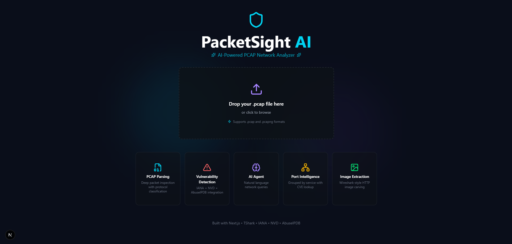
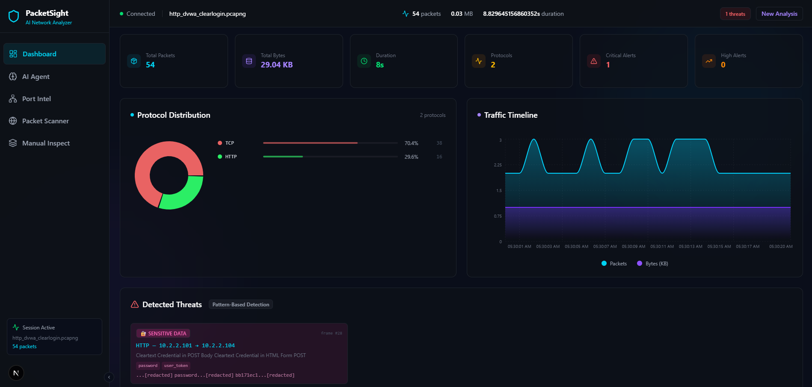
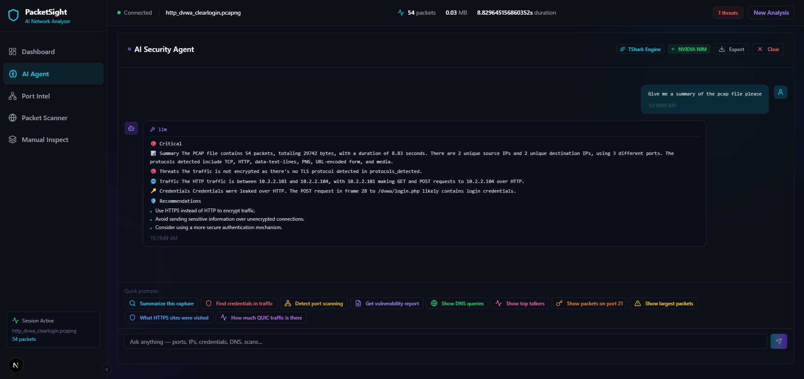

<div align="center">


# 🛡️ PacketSight AI — PCAP Network Analyzer

**Upload a `.pcap` file. Get a full AI-powered network forensics dashboard.**

[](https://nextjs.org/)
[](https://nodejs.org/)
[](https://tailwindcss.com/)
[](https://groq.com/)
[](LICENSE)

</div>

---

## 📖 What is this?

**PacketSight AI** is a full-stack web application that lets you upload `.pcap` / `.pcapng` network capture files and instantly get:

- A visual dashboard with traffic stats, protocol breakdown, and timelines
- AI-powered threat detection and vulnerability alerts
- An interactive AI Agent (powered by Groq LLaMA) you can chat with about your traffic
- Port intelligence with IANA service lookups
- Deep packet inspection with TCP/UDP stream reassembly
- Extracted objects (images, files) from captured HTTP traffic

No Wireshark needed. Just upload and analyze.

---

## ✨ Features

| Feature | Description |
|---|---|
| 📤 **PCAP Upload** | Drag & drop `.pcap` / `.pcapng` files with live upload progress |
| 📊 **Dashboard** | Stats bar, protocol pie chart, traffic timeline, vulnerability alerts |
| 🤖 **AI Agent** | Chat with LLaMA 3.3 70B about your capture — ask anything |
| 🔍 **Packet Scanner** | Browse, filter, and search packets with full dissection view |
| 🌐 **Port Intel** | IANA port lookup + AbuseIPDB threat reputation per IP |
| 🧪 **Manual Inspection** | Deep layer-by-layer packet dissection with TCP/UDP stream follow |
| 📦 **Object Extraction** | Extract images and files transferred over HTTP in the capture |
| ☁️ **Cloud Storage** | PCAP files stored on Backblaze B2 (S3-compatible) |
| 🔄 **WebSocket Progress** | Real-time processing progress via WebSocket |
| 🌍 **Dev Tunnel** | `devtunnel`-based watchdog to expose local backend publicly |

---

## 🏗️ Project Structure

```
pcap-analyzer/
├── frontend/               # Next.js 15 app (TypeScript + Tailwind + shadcn/ui)
│   └── src/
│       ├── app/            # Next.js app router (page, layout, globals)
│       ├── components/
│       │   ├── agent/      # AI Agent chat interface
│       │   ├── dashboard/  # StatsBar, ProtocolPieChart, TrafficTimeline, VulnerabilityAlerts
│       │   ├── layout/     # Sidebar + Navbar
│       │   ├── manual-inspection/  # Deep packet dissection view
│       │   ├── packets/    # Packet scanner & filter
│       │   ├── port-intel/ # Port intelligence page
│       │   └── ui/         # shadcn/ui component library
│       ├── hooks/          # Custom React hooks
│       └── lib/            # Zustand store, types, utils
│
├── backend/                # Node.js HTTP server (no Express)
│   ├── index.js            # All routes, tshark integration, AI calls
│   ├── ecosystem.config.js # PM2 config
│   └── iana_ports_cache.json  # Cached IANA port data
│
└── startup/
    └── start-tunnel.bat    # devtunnel watchdog script (Windows)
```

---

## 🖥️ Tech Stack

**Frontend**
- [Next.js 15](https://nextjs.org/) with App Router
- [TypeScript](https://www.typescriptlang.org/)
- [Tailwind CSS](https://tailwindcss.com/) + [shadcn/ui](https://ui.shadcn.com/)
- [Zustand](https://zustand-demo.pmnd.rs/) for state management
- [Framer Motion](https://www.framer.com/motion/) for animations
- [Recharts](https://recharts.org/) for data visualization

**Backend**
- [Node.js](https://nodejs.org/) — pure HTTP server (no Express)
- [tshark](https://www.wireshark.org/docs/man-pages/tshark.html) — packet parsing engine
- [Groq API](https://groq.com/) — LLaMA 3.3 70B for AI agent
- [NVIDIA NIM API](https://www.nvidia.com/en-us/ai/) — LLaMA 4 Maverick (fallback AI)
- [Backblaze B2](https://www.backblaze.com/b2/) — S3-compatible PCAP storage
- [AbuseIPDB](https://www.abuseipdb.com/) — IP reputation lookups
- [NVD API](https://nvd.nist.gov/developers) — CVE vulnerability data
- [SearXNG](https://searxng.github.io/searxng/) — self-hosted web search for AI agent
- [WebSocket (ws)](https://github.com/websockets/ws) — real-time progress updates
- [PM2](https://pm2.keymetrics.io/) — process management

---

## ⚙️ Prerequisites

Make sure you have the following installed:

- [Node.js](https://nodejs.org/) v18+
- [tshark](https://www.wireshark.org/download.html) (part of Wireshark) — must be in `PATH`
- A [Groq API key](https://console.groq.com/) (free)
- A [Backblaze B2](https://www.backblaze.com/b2/) bucket + credentials
- A running [SearXNG](https://searxng.github.io/searxng/) instance (for AI web search)

Optional but recommended:
- [AbuseIPDB API key](https://www.abuseipdb.com/api) — for IP threat intel
- [NVD API key](https://nvd.nist.gov/developers/request-an-api-key) — for CVE lookups
- [NVIDIA NIM API key](https://build.nvidia.com/) — for fallback AI model

---

## 🚀 Getting Started

### 1. Clone the repo

```bash
git clone https://github.com/Newbie-amitian/pcap-analyzer.git
cd pcap-analyzer
```

### 2. Setup the Backend

```bash
cd backend
npm install
```

Create a `.env` file in `backend/`:

```env
# Required
GROQ_API_KEY=your_groq_api_key
GROQ_MODEL=llama-3.3-70b-versatile
SEARXNG_URL=http://your-searxng-instance

# Backblaze B2 Storage
B2_KEY_ID=your_b2_key_id
B2_APP_KEY=your_b2_app_key
B2_BUCKET_NAME=your_bucket_name
B2_BUCKET_REGION=us-west-004
B2_ENDPOINT=https://s3.us-west-004.backblazeb2.com

# Optional
NVIDIA_API_KEY=your_nvidia_key
NVIDIA_MODEL=meta/llama-4-maverick-17b-128e-instruct
NVD_API_KEY=your_nvd_key
ABUSEIPDB_API_KEY=your_abuseipdb_key
ALLOWED_ORIGIN=http://localhost:3000
PORT=3001
```

Start the backend:

```bash
# Development
node index.js

# Or with PM2 (production)
npm install -g pm2
pm2 start ecosystem.config.js
```

### 3. Setup the Frontend

```bash
cd frontend
npm install
```

Create a `.env.local` file in `frontend/`:

```env
NEXT_PUBLIC_API_URL=http://localhost:3001
```

Start the frontend:

```bash
npm run dev
```

Open [http://localhost:3000](http://localhost:3000) in your browser.

---

## 🌐 API Endpoints

| Method | Endpoint | Description |
|---|---|---|
| `POST` | `/upload` | Upload a PCAP file, returns `session_id` |
| `GET` | `/api/summary/:sessionId` | Get traffic summary for a session |
| `GET` | `/api/ports/:sessionId` | List all ports seen in capture |
| `GET` | `/api/ports-intel/:sessionId` | Port intelligence with IANA + threat data |
| `GET` | `/api/threats/:sessionId` | Vulnerability and threat alerts |
| `POST` | `/api/reanalyze/:sessionId` | Re-run analysis on a session |
| `GET` | `/pcap/packets` | Paginated packet list with filters |
| `GET` | `/pcap/packet-dissection` | Full layer dissection for a single packet |
| `GET` | `/pcap/tcp-stream` | Reassembled TCP stream |
| `GET` | `/pcap/udp-stream` | Reassembled UDP stream |
| `POST` | `/pcap/filter` | Apply Wireshark display filter |
| `GET` | `/pcap/filter-fields` | List available tshark filter fields |
| `GET` | `/pcap/objects` | List extracted HTTP objects |
| `GET` | `/pcap/objects/zip` | Download all extracted objects as ZIP |
| `GET` | `/pcap/image-data` | Get a specific extracted image |
| `POST` | `/pcap/agent/stream` | Streaming AI agent response (SSE) |
| `POST` | `/pcap/agent/query` | Non-streaming AI agent query |
| `GET` | `/health` | Health check |

> WebSocket connects on the same port for real-time upload/processing progress.

---

## 🔧 Dev Tunnel (Windows)

To expose your local backend publicly (for testing with a deployed frontend):

```bat
cd startup
start-tunnel.bat
```

This script:
- Starts a `devtunnel` and keeps it alive with a watchdog loop
- Auto-updates `frontend/.env.local` and `backend/.env` with the tunnel URL
- Logs everything to `startup/start-tunnel.log`

Requires [devtunnel CLI](https://learn.microsoft.com/en-us/azure/developer/dev-tunnels/get-started) to be installed and authenticated.

---

## 📸 Screenshots

**Upload Page** — drag & drop your `.pcap` file to get started


**Dashboard** — protocol distribution, traffic timeline, and live threat detection


**AI Security Agent** — chat naturally with LLaMA about your capture


---

## 🤝 Contributing

Pull requests are welcome! For major changes, please open an issue first.

1. Fork the repo
2. Create your branch: `git checkout -b feature/your-feature`
3. Commit your changes: `git commit -m "feat: add your feature"`
4. Push: `git push origin feature/your-feature`
5. Open a Pull Request

---

## 📄 License

[Apache 2.0](LICENSE) — free to use, modify, and distribute with attribution. Patent rights explicitly granted.

---

<div align="center">
  Made with ☕ and tshark by <a href="https://github.com/Newbie-amitian">Newbie-amitian</a>
</div>
